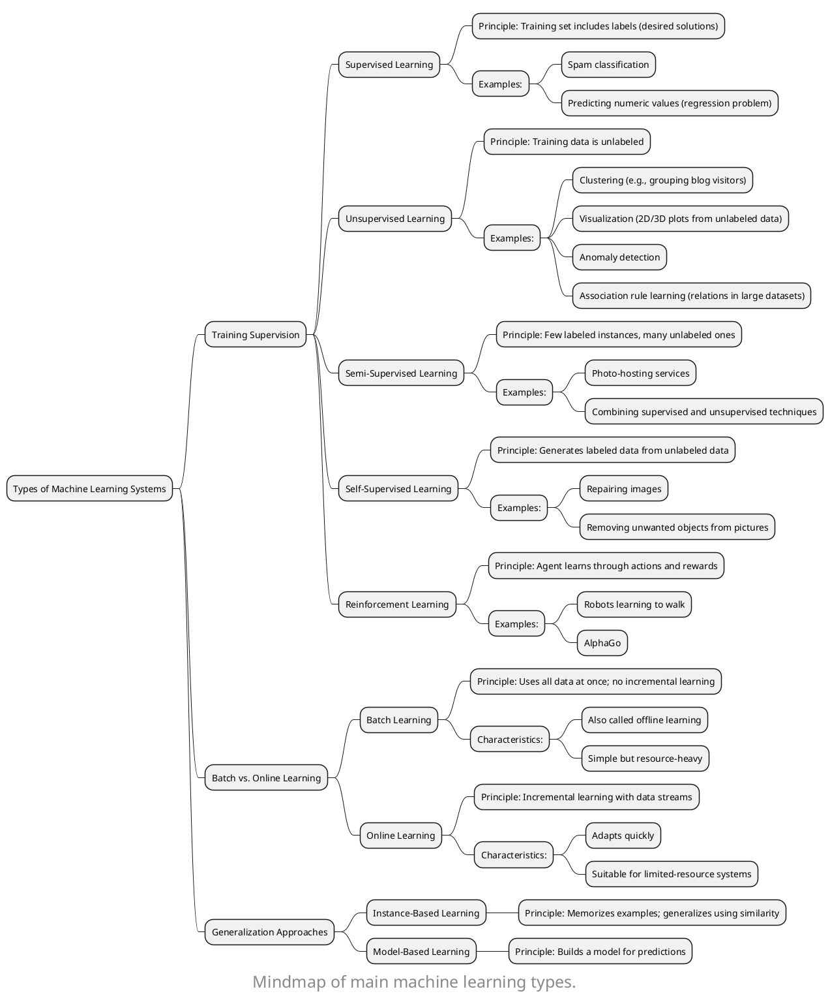

<!-- toc -->
#  Introduction  

Welcome to [this blog series]([tags/Machine Learning](https://emilypeng2017.github.io/tags/Hands-On-Machine-Learning/)), where I document my journey through the acclaimed book [*Hands-On Machine Learning with Scikit-Learn, Keras, and TensorFlow*](https://www.oreilly.com/library/view/hands-on-machine-learning/9781492032632/) by Aurélien Géron.  
<!-- more -->
This book is a treasure trove for anyone eager to build practical machine learning and deep learning skills using Python libraries like **Scikit-Learn**, **Keras**, and **TensorFlow**. My goal is to:  

1. **Understand and implement** the algorithms discussed in the book.  
2. **Apply these algorithms** to solve real-world problems (haha, of course related to my research, stay tuned!!😁).  

Each post in this series will explore a specific chapter or concept, enriched with:  
- Practical code examples  
- Key insights  
- Lessons learned along the way  

#  Key Takeaways  

## When is **Machine Learning** particularly useful?  

Machine learning shines in the following scenarios:  

1️⃣ Problems with complex or variable rules  
When existing solutions require:  
- Extensive fine-tuning  
- Long, hard-to-maintain rule sets  

2️⃣ Challenges where traditional methods fail  
When conventional programming approaches struggle to deliver a good solution.  

3️⃣ Dynamic or fluctuating environments  
When systems need to adapt to:  
- Changing conditions  
- Evolving data patterns  

4️⃣ Analyzing complex or massive datasets  
Machine learning can extract meaningful insights from:  
- Large volumes of data  
- Highly intricate problem domains   

#  Types of Machine Learning Systems  

## **Training Supervision**  
Classifying machine learning systems based on how they are supervised during training:  

### **Supervised Learning**  
- **Principle**: The training set includes the desired solutions, called *labels*.  
- **Examples**:  
  1. A labeled training set for spam classification.  
  2. Predicting a target numeric value (a regression problem).  

### **Unsupervised Learning**  
- **Principle**: The training data is unlabeled, and the system learns without a teacher.  
- **Examples**:  
  1. Clustering algorithms to detect groups of similar blog visitors.  
  2. Visualization algorithms that process complex unlabeled data into 2D/3D plots.  
  3. Anomaly detection.  
  4. Association rule learning: Discovering interesting relations between attributes in large datasets.  

### **Semi-Supervised Learning**  
- **Principle**: Combines a few labeled instances with a large number of unlabeled ones, reducing the cost and effort of labeling.  
- **Examples**:  
  1. Some photo-hosting services.  
  2. Algorithms that blend supervised and unsupervised techniques.  

### **Self-Supervised Learning**  
- **Principle**: Generates labeled data from an unlabeled dataset, enabling supervised learning techniques to be applied.  
- **Examples**:  
  - Repairing damaged images or erasing unwanted objects from pictures.  

### **Reinforcement Learning**  
- **Principle**: An agent learns by interacting with the environment, performing actions, and receiving rewards or penalties.  
- **Examples**:  
  1. Robots learning how to walk.  
  2. DeepMind’s AlphaGo.  

---

## **Batch vs. Online Learning**  
Classifying systems based on whether they learn incrementally from incoming data:  

### **Batch Learning**  
- **Principle**: Requires all data at once; cannot learn incrementally.  
- **Key Features**:  
  - Also called *offline learning*: Trained first, then deployed without further learning.  
  - **Pros**: Simple and often effective.  
  - **Cons**: Time-intensive and resource-heavy.  

### **Online Learning**  
- **Principle**: Learns incrementally by sequentially processing data (individually or in *mini-batches*).  
- **Key Features**:  
  - **Pros**: Adapts quickly to changing environments; works on systems with limited resources.  
  - **Cons**: Prone to degradation if fed with poor-quality data.  

---

## **Generalization Approaches**  
### **Instance-Based Learning**  
- **Principle**: Memorizes examples and generalizes to new cases using similarity measures.  

### **Model-Based Learning**  
- **Principle**: Builds a model of the examples and uses it for predictions.  

---

#  Main Challenges in Machine Learning  

1. **Insufficient Training Data**: Small datasets may not represent the problem well.  
2. **Nonrepresentative Data**: The data may fail to capture the true distribution.  
3. **Poor-Quality Data**: Cleaning the training data can greatly improve results.  
4. **Irrelevant Features**: Feature selection is crucial for model success.  
5. **Overfitting**: The model performs well on training data but poorly on unseen data.  
6. **Underfitting**: The model fails to capture the complexity of the data.  

---

#  Testing and Validating Models  

1. **Data Splitting**: Divide data into training and test sets.  
2. **Hyperparameter Tuning and Model Selection**: Fine-tune parameters to improve performance.  

### **No Free Lunch Theorem**  
> If no assumptions are made about the data, there’s no reason to prefer one model over another.  

---  
